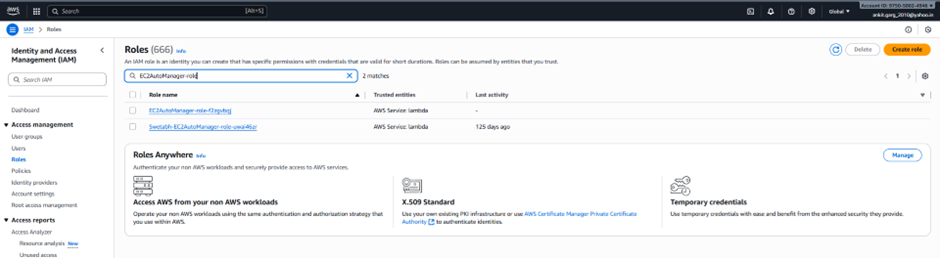

# Serverless-Architecture

### Assignment 1: Automated Instance Management Using AWS Lambda and Boto3
- #### Step 1: Setup EC2 Instances & Tags
    - ##### Go to EC2 Console → Instances → Launch instances.
    
    
    

    - #### After they’re running, select each one → Tags → Manage tags:
    
    
    
    

- #### Step 2: Create the Lambda Function
    - ##### Go to AWS Lambda Console → Create function
        - ###### Choose:
            - 1.	Author from scratch
            - 2.	Function name: EC2AutoManager
            - 3.	Runtime: Python 3.9+
            - 4.	Execution role: “Create a new role with basic Lambda permissions”
    
    

- #### Step 3: Add IAM Permissions to the Role
    - ##### Go to IAM Console → Roles → Find your Lambda’s role
        - Attach the following managed policy: AmazonEC2FullAccess
    
    

- #### Step 4: Write the Lambda Function Code
    - Refer Assignment1.py for the Lambda code.

- #### Step 5: Test the Lambda Function
            - 1.	In the Lambda console → Test tab.
            - 2.	Configure a test event (any JSON; the event isn’t used, e.g. {}).
            - 3.	Click Test.

            - Expected behavior:
                •	The EC2 instance tagged Auto-Stop=True stops.
                •	The EC2 instance tagged Auto-Start=True starts.
    
    
    
    
    
    
